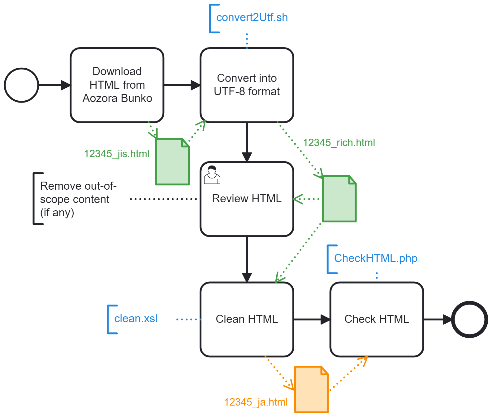
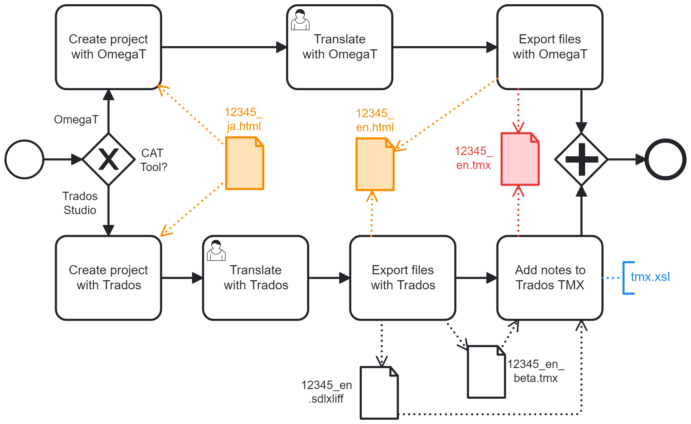
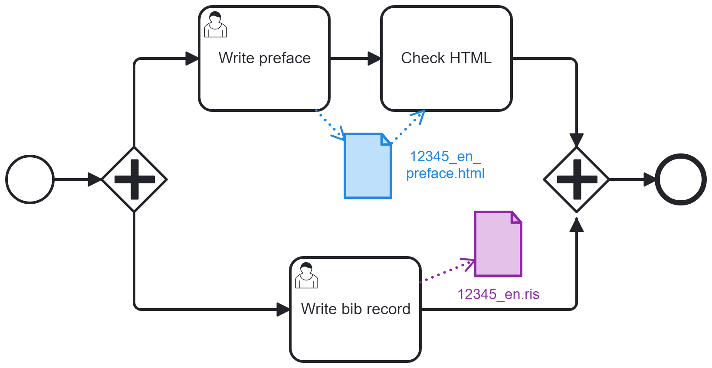
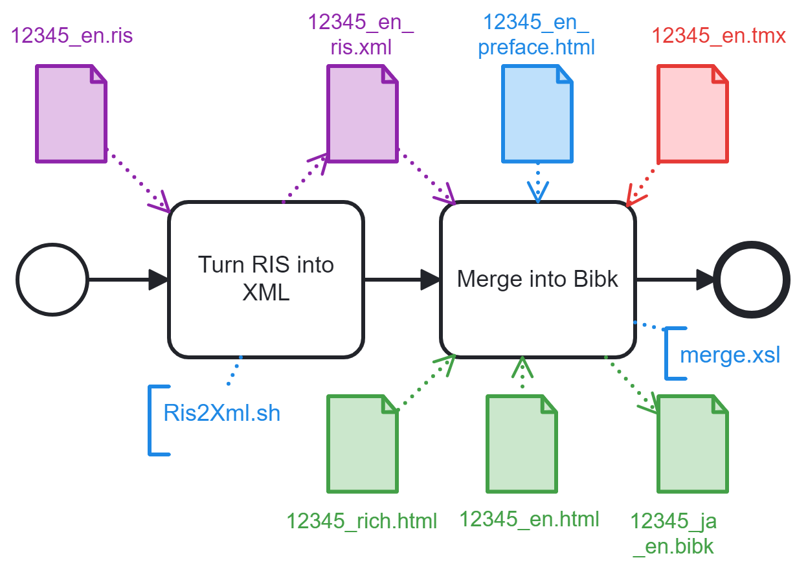

blue-sora is a preparation chain generating bilingual bibk files from Aozora Bunko HTML documents. Tools should works on all platforms, with minimal requirements: Saxon-like processor for XSLT 1.0 and 2.0, PHP 5+.

# Initial workflow to create a new document

## File description:
- **12345_jis.html**: XHTML file available on Aozora.gr.jp. 12345 corresponds typically to the Aozora Bunko Card number, but you can use another naming convention.
- **12345_ja.html**: Cleaned up version of the above XHTML file: it contains only texts that require translation.
- **12345_furigana.xml**: Japanese reading helper extracted from the JIS file. No translation is needed.
- **12345_note.xml**: Japanese publisher notes from Aozora extracted from the JIS file. No translation is needed.
- **12345_en.html**: English translation of 12345_ja.html. Note: If your language is not English, don't worry: The process is the same for any language, not just English.
- **12345_en.tmx**: Translation memory generated by the translation tool. It contains the Japanese to English segment mapping and translator’s notes.
- **12345_en_preface.html**: A preface for English readers, in XHTML format.
- **12345.ris**: Bibliographic record for English readers.
- **12345.bibk**: Bilingual book in an XML format similar to DocBook V5.x.
## 1. Clean up the HTML file in Japanese

### File description:
- **12345_jis.html**: XHTML file available on Aozora.gr.jp. 12345 corresponds typically to the Aozora Bunko Card number, but you can use another naming convention.
- **12345_utf.html**: Intermediate XHTML file for review. Main characteristics compared to the Shift JIS source file:
  - UTF-8 encoding only (no graphic resource is used for rare kanji)
  - Optimized for horizontal reading
  - Automatic chapter and paragraph numbering
  - No bibliographic info
- **12345_furigana.xml**: Japanese reading helper. Translating this file does not make sense. Conform to furigana.dtd format.
- **12345_note.xml**: Japanese publisher notes from Aozora. Based on our experience, we assume that no translation is needed, as these notes usually contains comments explaining that Aozora picked up a character that is slightly different from the paper document they scanned. Conform to note.dtd format.
- **12345_ja.html**: Cleaned up version of 12345_utf.html. It contains only the text to translate. Main characteristics compared to the UTF file:
  - No metadata
  - No furigana
  - No Aozora Bunko publisher note
  - XHTML 1.0 Strict compliance
### Tool description:
- **convert2Utf.sh**: Bash script (tested with Cygwin on Windows)  
  Usage: `./convert2Utf.sh ../documents/12345_jis.html ../documents/12345_utf.html`
- **furigana.xsl**: XSL stylesheet V1.0
- **note.xsl**: XSL stylesheet V1.0
- **clean.xsl**: XSL stylesheet V1.0
- **CheckHTML.php** based on  to inspect the HTML body  
  Usage: `php.exe CheckHTML.php ../documents/12345_ja.html`
## 2. Translate the document

### File description:
- **12345_ja.html**: File to translate. Format: XHTML 1.0 Strict
- **12345_en.html**: English translation of the above file.  
  Note: If your language is not English, don't worry: The process is the same for any language, not just English.
- **12345_en.tmx**: Translation memory generated by translation tools. It contains the Japanese to English segment mapping and translator’s notes.
- **12345_en_beta.tmx**: Translation memory generated by Trados Studio. It contains the Japanese to English segment mapping but not the translator’s notes.
- **12345_en.sdlxliff**: XML Localization Interchange File generated by the Trados Studio. It contains translator's notes.

## 3. Add some extra information

### File description:
- **12345_en.ris**: Single bibliographic record in [RIS format](https://en.wikipedia.org/wiki/RIS_(file_format)). Only a few tags are actually used: TI (or T1 or CT) for the (English) document title, AU (or A1) for the main author(s), A4 for the translator(s), PY for the publication year, AB for the abstract, UR for the back link to the original Aozora Bunko card.
- **12345_en_preface.html**: Preface or introduction to the main English translation 12345_en.html. Format: XHTML 1.0 Strict. Use CheckHTML.php to check the file `<body>` format.
## 4. Merge the files into a bibk file

### File description:
- **12345_en.ris**: Single bibliographic record in [RIS format](https://en.wikipedia.org/wiki/RIS_(file_format)).
- **12345_en_ris.xml**: XML-style bibliographic record, limited to a few tags: TI (or T1 or CT), AU (or A1), A4 for the translator(s), PY, AB and UR.
- **12345_furigana.xml**: Japanese reading helper.
- **12345_note.xml**: Original publisher notes in Japanese.
- **12345_en_preface.html**: Preface or introduction to the main English translation 12345_en.html.
- **12345_ja.html**: HTML document (in Japanese) that has been translated.
- **12345_en.html**: English translation of the above file.
- **12345_en.tmx**: Translation memory generated by translation tools. It contains the Japanese to English segment mapping and translator’s notes.
- **12345_ja_en.bibk**: Bilingual book in [Bibk format](https://github.com/japotrad/bibk)
### Tool description:
- **Ris2Xml.sh**: Bash script (tested with Cygwin on Windows)  
  Usage: `./Ris2Xml.sh ../documents/12345_en.ris ../documents/12345_en_ris.xml`
- **merge.xsl**: XSL stylesheet V2.0 processing the main translation file (12345_en.html)  
  Input parameters:  
  - *lang*: Language of 12345_en.html (by default: substring between underscore and dot from the main translation file)  
  - *ris*: Path to the XML-formatted RIS file (by default: generated from the main translation file name, by replacing .html with _ris.xml)  
  - *furi*: Path to the furigana file (by default: generated from the main translation file name, by replacing _en.html with _furigana.xml)  
  - *note*: Path to the note file (by default: generated from the main translation file name, by replacing _en.html with _note.xml)  
  - *preface*: Path to the preface file in English (by default: generated from the main translation file name, by replacing .html with _preface.html)  
  - *ja*: - **12345_ja.html**: Path to the Japanese HTML document (by default: generated from the main translation file name, by replacing _en.html with _ja.html)  
  - *tmx*: - **12345_ja.html**: Path to the translation memory (by default: generated from the main translation file name, by replacing .html with .tmx)  
  
 

# Iterative workflow to update an existing document
## - Update of the HTML file in Japanese
There are two distinct cases to consider depending whether the update impacts the main text or furiganas.
## - Update of the HTML file in English
## - Update of the Preface in English
## - Update of the Bibliographic Details
---
BPMN diagrams made with Camunda Modeler. [Big thanks to them!](https://camunda.com/)
